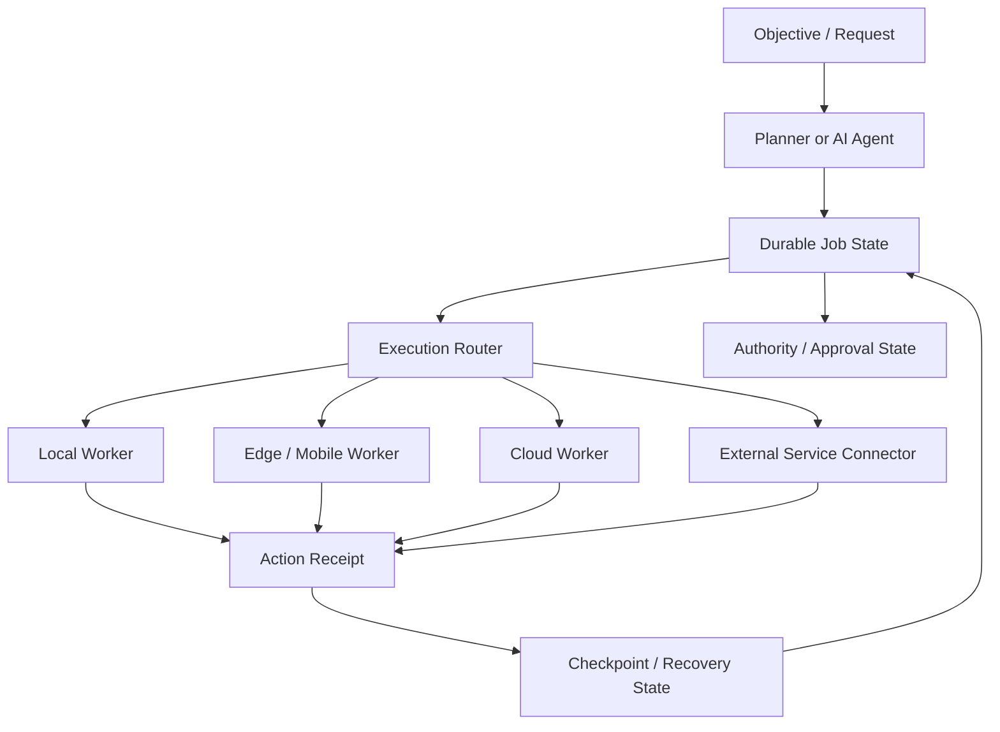

# AgentLink Architecture Overview

This document intentionally describes architecture at a **conceptual** level. It excludes production endpoints, credentials, internal hostnames, private network topology, and sensitive authorization implementation.

## Execution model

## Core ideas

### 1. Durable job identity

Long-running work should have a stable identity that survives individual chat turns, process restarts, route changes, or worker changes.

A durable job can reference:

- objective
- current state
- completed actions
- pending actions
- approval / authority state
- worker capability needs
- checkpoints and receipts

### 2. Action receipts

Execution should produce receipts that make it possible to answer questions such as:

- Was an action attempted?
- Did it complete?
- Which worker performed it?
- What state changed?
- Is retry safe?

Receipts are especially important when external side effects may not be safely repeatable.

### 3. Capability-aware routing

Workers have different capabilities, trust levels, latency, cost, and availability. AgentLink treats worker choice as an execution-layer problem rather than assuming one machine or one provider is always available.

### 4. Recoverable execution

The platform explores recovery rules that distinguish between:

- safe replay
- unsafe replay
- already completed work
- uncertain completion
- work that requires renewed human approval

### 5. Authority boundaries

Autonomous execution should not imply unlimited authority. Sensitive operations can require explicit approval or narrower scopes.

Conceptually, authority can include:

- capability scope
- expiration
- revocation
- resource scope
- action class
- human approval requirements

### 6. Parallel coordination

Multiple workers can increase throughput but create risks such as:

- duplicate work
- stale assumptions
- conflicting writes
- unclear ownership

AgentLink is exploring resource-scoped ownership, leases, receipts, and conflict controls to reduce these problems.

## Design principle

**Model intelligence and execution reliability are different layers.**

AgentLink aims to remain compatible with multiple model providers and agent frameworks while specializing in persistent, controlled execution.

## Security note

This architecture overview omits implementation details that could materially increase attack surface. See [SECURITY.md](./SECURITY.md).