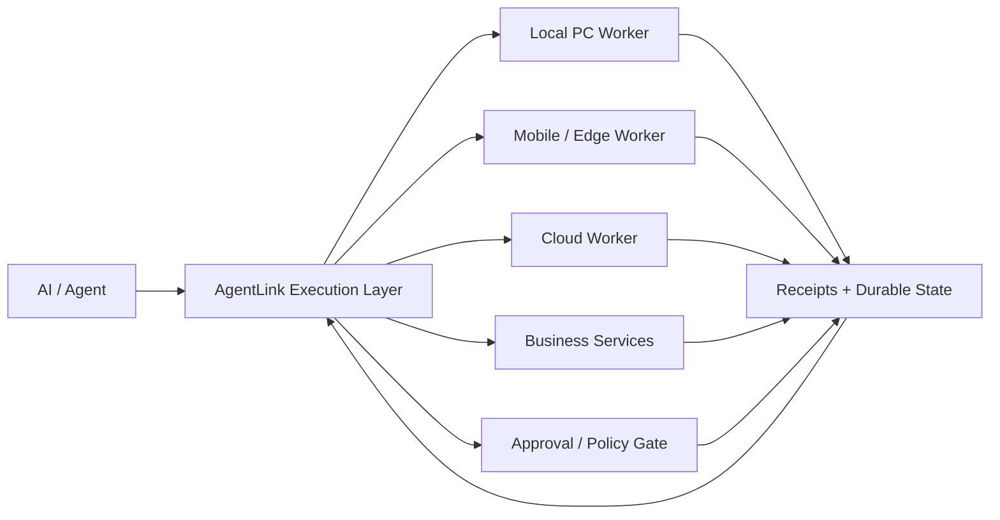

# AgentLink

**Persistent, permissioned, recoverable execution infrastructure for long-running AI workers.**

AgentLink explores the execution layer between AI reasoning and real operational work: keeping jobs alive across interruptions, bounding authority, coordinating workers, avoiding duplicate external side effects, and leaving enough evidence to recover safely.

> This public repository is a technical showcase and evidence surface. The production core is private and is **not** published here.

## Why AgentLink exists

Models are increasingly capable planners and tool users. Operational work still becomes fragile when it crosses sessions, devices, services, browser state, approvals, network failures, and long-running worker handoffs.

AgentLink focuses on five properties:

- **continuity** — work can resume from durable state instead of one chat window
- **bounded authority** — workers operate inside explicit capabilities and human gates
- **idempotency** — uncertain outcomes are reconciled instead of blindly replayed
- **coordination** — multiple workers can own separate lanes without duplicating work
- **evidence** — important actions leave receipts, checkpoints, tests or other verifiable state

## Architecture

The goal is not to replace foundation models. The goal is to make them more useful when work must survive real-world execution boundaries.

## Public proof surfaces

The public repository contains deliberately bounded demonstrations, documentation and case studies rather than the production runtime.

- **[Receipt Replay Simulator](./demos/receipt-replay-simulator/)** — demonstrates conservative recovery for completed, not-started and uncertain actions
- **[Site Surface Doctor proof](./PUBLIC_PROOF_SITE_SURFACE_DOCTOR.md)** — static-site preflight evidence covering responsive `srcset` assets, path boundaries, sitemap checks and CI-verified mixed data/local candidate handling
- **[RAG Fleet Harness MVP case study](./CASE_STUDY_RAG_FLEET.md)** — isolated agent configuration, routing, validation, health reporting and an automated test suite
- **[Architecture notes](./ARCHITECTURE.md)** — execution-layer design and boundaries
- **[Technical proofs](./TECHNICAL_PROOFS.md)** — public evidence for selected implementation claims
- **[Security boundary](./SECURITY.md)** — what is intentionally not exposed

Public claims should be backed by implementation evidence, tests, receipts, or a reproducible demo. If evidence is not available, the claim should stay narrow.

## Current engineering directions

The private implementation currently spans areas such as:

- persistent job and thread state
- local / remote worker execution
- Android, PC and gateway integration
- execution receipts and replay prevention
- worker leases and stale-owner recovery
- multi-route execution and fallback
- permission / approval boundaries
- parallel work lanes and conflict control
- browser and service recovery
- long-turn Company OS experiments

These are active engineering directions, not promises that every surface is production-ready.

## Reliability model

A central rule is simple: **unknown is not the same as failed**.

When an external action is interrupted, recovery should prefer:

1. read back durable state or a receipt
2. determine whether the side effect already happened
3. resume from the latest valid checkpoint
4. retry only when duplicate execution is safe or ruled out

This is why AgentLink treats checkpoints, idempotency keys, effect receipts and human gates as first-class execution state rather than logging afterthoughts.

## AI-native Company OS thesis

AgentLink is also used as an internal operating substrate for AI workers. The goal is to test the execution model under real workloads before turning selected capabilities into reusable products or services.

A Company OS lane can own durable work, hand bounded tasks to child workers, collect evidence, survive thread or browser loss, and continue from state instead of relying on one conversation URL.

Human operators remain responsible for legal accountability, governance, sensitive approvals, identity-bound actions and other authority that should not be delegated.

## Open tools and practical packs

Selected small tools and workflow packs are published separately when they are useful outside the private AgentLink runtime.

- [Public tools / portfolio](https://paper-daemon.github.io/portfolio/)
- [Finder hub](https://paper-daemon.github.io/finders.html)
- [Service scopes](./SERVICES.md)
- [Digital products](./DIGITAL_PRODUCTS.md)
- [Free AI Automation Readiness Checklist](./FREE_AI_AUTOMATION_READINESS_CHECKLIST.md)

The public catalog includes ordinary CSV, subtitle, repository-health, automation-safety and creator-workflow tools as well as AI-agent material. Small tools can stay small, but they should have a clear purpose, usable instructions, explicit boundaries and a reproducible verification path when applicable.

## Paid engineering scope

Paid work is kept separate from technical claims. Current scopes are listed in **[SERVICES.md](./SERVICES.md)** and may include narrow automation reviews, reliability / recovery reviews, RAG / agent architecture work and bounded proof-of-concept implementation.

Fixed-price offers define what is included and excluded. Larger work requires scope confirmation before implementation. Payment does not turn an experimental capability into a production guarantee.

## R&D themes

Current questions include:

- how to fail over without duplicating external side effects
- how authority should survive, narrow, expire or revoke across worker migration
- how to recover long-running jobs without replaying completed actions
- how parallel workers coordinate without globally serializing useful work
- how to keep execution state compact enough for long-horizon operation
- how to separate model reasoning from durable operational truth

See [ARCHITECTURE.md](./ARCHITECTURE.md), [TECHNICAL_PROOFS.md](./TECHNICAL_PROOFS.md) and [ROADMAP.md](./ROADMAP.md).

## What is intentionally not public

The public repository does **not** contain:

- production AgentLink source code
- credentials, tokens, secrets or private URLs
- internal host / network details
- detailed authorization internals that would materially increase attack surface
- private customer or user data
- internal operational state and sensitive runbooks

See [SECURITY.md](./SECURITY.md).

## Current stage

AgentLink is an early-stage platform and R&D project. Current priorities include repeatable onboarding, reliability measurement, security hardening, bounded commercial use cases, public proof quality and clearer separation between experimental research and stable reusable tools.

## Support and collaboration

For a non-confidential engineering inquiry, design-partner discussion, technical collaboration or project support, use the public service/contact surfaces linked above or open a GitHub Issue where appropriate.

Do not post credentials, API keys, personal data, proprietary datasets or other confidential information in a public issue.

## Repository status

This repository is a **public showcase and documentation repository**, not the production AgentLink source tree.

No license is granted to unpublished AgentLink core code. Public repository content remains subject to [NOTICE.md](./NOTICE.md).
