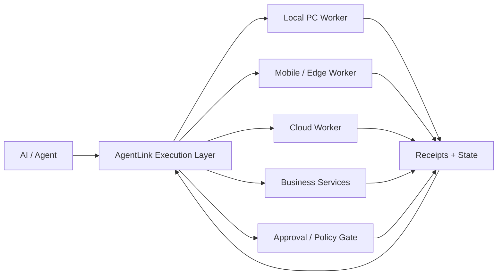

# AgentLink

**Persistent, permissioned, recoverable execution infrastructure for AI workers.**

AgentLink is an early-stage AI execution platform exploring how AI agents can continue useful work across computers, mobile/edge devices, cloud workers, and business services without losing execution state, authority boundaries, or recovery context.

> This repository is a public product / technical showcase. The production core is private and is **not** published here.

## Why AgentLink exists

AI models are becoming strong planners and tool users. Real operational work still becomes fragile when it crosses sessions, devices, networks, services, and authorization boundaries.

AgentLink focuses on the layer between **AI reasoning** and **reliable execution**:

- durable work continuity
- heterogeneous worker orchestration
- failure recovery and route failover
- scoped approvals and authority
- action receipts and operational state
- parallel worker coordination

## Concept

The goal is not to replace foundation models. AgentLink is intended to make multiple models and agents more useful by giving them a persistent execution substrate.

## What is already being explored

The private implementation currently spans several directions, including:

- Android / PC / gateway integration
- persistent sessions and job state
- local and cloud worker execution
- execution receipts and replay concepts
- capability leases and worker availability
- failure recovery and stale-owner recovery
- multi-route execution
- permission / approval boundaries
- parallel work lanes and conflict-control research

Only claims that can be backed by implementation evidence are used in external discussions.

## First public technical demo

A deliberately simplified, standalone reliability demo is now public:

**[Receipt Replay Simulator](./demos/receipt-replay-simulator/)**

It demonstrates a conservative recovery rule for interrupted actions:

- completed receipt → skip duplicate execution
- not-started receipt → retry
- uncertain receipt → reconcile instead of blindly replaying

The demo is intentionally separate from production AgentLink and contains no private infrastructure or authorization implementation.

## Company thesis

AgentLink is also being developed around an **AI-native company** thesis: use the platform internally as the operating substrate for AI workers before commercializing selected capabilities externally.

Human operators remain responsible for legal accountability, governance, sensitive approvals, and other actions that require human authority.

The intended company structure and legal entity are still being prepared. `AgentLink` is currently used here as the project / product name.

## Enterprise design-partner PoCs

We are exploring three initial paid PoC patterns:

1. **Persistent AI Operations Worker**
   - multi-step business workflow
   - interruption recovery
   - measurable reduction in manual intervention

2. **Secure Agent Execution Gateway**
   - controlled execution environment
   - scoped action permissions
   - approval and audit receipts

3. **Multi-Agent Business Operations Cell**
   - coordinated workers around one narrow objective
   - explicit lane ownership
   - conflict and duplicate-work reduction

See [POC.md](./POC.md).

## R&D themes

Current technical questions include:

- how to fail over without duplicating external side effects
- how authority should survive, narrow, expire, or revoke across worker migration
- how to recover long-running jobs without replaying already-completed actions
- how parallel workers coordinate without globally serializing all useful work
- how execution state stays compact enough for long-horizon operation

See [ARCHITECTURE.md](./ARCHITECTURE.md) and [TECHNICAL_PROOFS.md](./TECHNICAL_PROOFS.md).

## What is intentionally not public

The following remain private:

- production source code
- internal endpoints and host information
- credentials, tokens, secrets, and private URLs
- detailed authorization implementation
- customer / user data
- internal operational runbooks that would materially increase attack surface

See [SECURITY.md](./SECURITY.md).

## Current stage

AgentLink is in an early product / pre-seed stage. Priorities are:

- repeatable third-party onboarding
- enterprise security hardening
- measurable reliability tests
- design partners and paid PoCs
- company / IP structuring
- non-dilutive R&D funding and seed financing

See [ROADMAP.md](./ROADMAP.md).

## Looking for

- enterprise design partners with a safe, measurable AI-agent workload
- AI infrastructure / enterprise software investors
- individual patrons and long-term supporters
- corporate sponsors and strategic patrons
- cloud / compute / model ecosystem partners
- hardware, GPU, cloud-credit, and security-review support
- technical collaborators interested in reliable agent execution

## Support, patronage, and sponsorship

AgentLink welcomes interest from people and organizations that want to help fund or resource the project while keeping the production core private and independent.

Support can include patronage, corporate sponsorship, cloud / GPU credits, hardware, security or legal support, introductions, and design-partner collaboration.

A formal financial contribution channel will be published only after the appropriate legal and accounting setup is ready. We do **not** currently claim that support is a tax-deductible charitable donation.

See [SUPPORT.md](./SUPPORT.md) for the current support policy and ways to get involved.

## Contact

For investment, partnership, sponsorship, patronage, or design-partner discussions, open a GitHub Issue with a non-confidential overview or contact the project owner through the GitHub profile associated with this repository.

## Repository status

This public repository is a **showcase and documentation repository**, not the production AgentLink source tree.

No license is granted to unpublished AgentLink core code. Content in this repository remains subject to the terms in [NOTICE.md](./NOTICE.md).